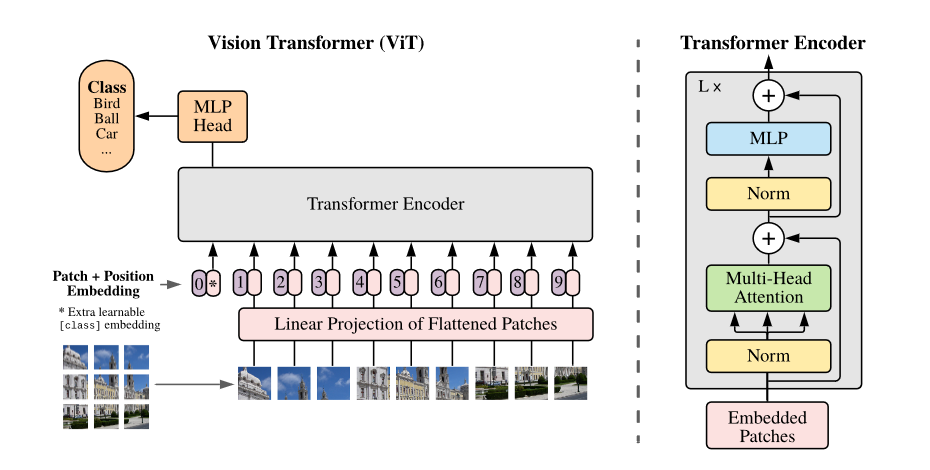
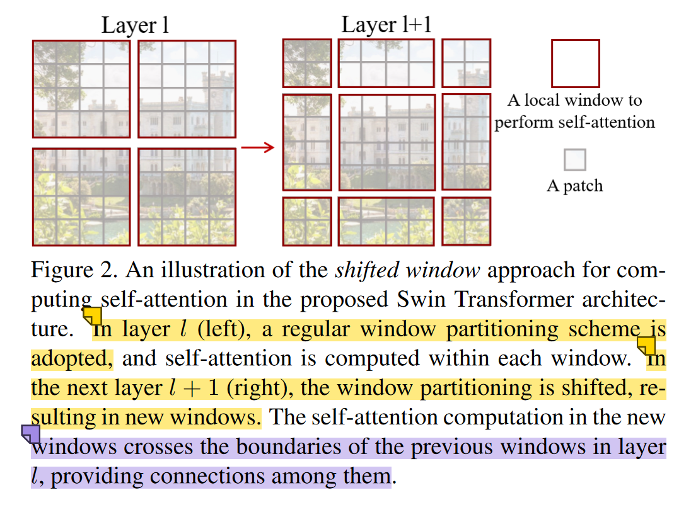

# 🤖 深度学习代码复现库

这是一个致力于将深度学习领域的经典论文代码进行复现或简化的项目。项目中包含多种网络实现，供学习使用。项目依赖Python3.9+和Pytorch。
通过这个项目，科研小白可以更好地理解深度学习模型的核心代码结构，并且也可以使用这些代码进行模型构建工作。

## 📚 项目介绍

本项目旨在为深度学习爱好者提供一个学习和交流的平台，通过复现经典的深度学习论文代码，来加深对深度学习模型的理解和掌握。我们主要包括以下几个部分：

- 深度学习模型的论文代码复现
- 模型的简化版本
- 相关的数据集和预训练模型
- 模型的训练和测试脚本
- 常用论文写作画图工具代码和样例
- 示例:

<div>
    
    
</div>

<div>
    
    
</div>

#### [点击这里查案画图示例库](./doc/Plot/README.md)

我们会根据深度学习领域的最新论文和热门模型，持续更新本项目，为大家提供更多有价值的代码和学习资源。

## 🚀 如何使用

我们的代码库支持直接下载和使用，但我们推荐使用 `git clone` 命令将整个代码库克隆到本地，以便您更好地管理和更新代码。具体使用方法如下：

```bash
$ git clone https://github.com/Karenina-na/Deep-Learning-Framework.git
```

在克隆代码库之后，您可以通过 `cd` 命令进入到具体模型的文件夹中，然后运行对应的训练或测试脚本即可。我们在每个模型文件夹中都提供了相应的说明文档，以帮助您更好地使用该模型。

## 💻 技术栈

我们在项目中使用了很多深度学习框架和相关的库，以下是我们主要使用的技术栈：

- PyTorch
- Numpy
- Pandas
- Matplotlib

## 🤝 如何贡献

我们非常欢迎您为我们的项目做出贡献！如果您有任何好的模型或论文代码想要分享，或者发现了代码中的错误或不足之处，都可以通过以下方式向我们提交贡献：

1. Fork 本项目
2. 创建您的特性分支 (`git checkout -b feature/AmazingFeature`)
3. 提交您的更改 (`git commit -m 'Add some AmazingFeature'`)
4. 将您的分支推送到远程仓库 (`git push origin feature/AmazingFeature`)
5. 提交拉取请求

我们会及时审核您的贡献，并将其合并到我们的项目中。同时，我们也非常感谢您对本项目的支持和关注！

## 📝 许可证

本项目采用 MIT 许可证，详情请参阅 [MIT](https://choosealicense.com/licenses/mit/) 文件。

## 📧 Notice

**知识产权和版权**

在整个项目开发过程中，我非常注重遵守知识产权和版权法律。为了确保项目的合法性和可靠性，我始终尊重他人的知识产权，并根据相关资料的许可协议进行了代码的使用和引用。

我通过互联网搜索和研究了各种相关资料，以便更好地理解和解决项目中的问题。在这个过程中，我尽力寻找有关的代码示例、解决方案和开源工具，并按照相关许可协议的规定进行了合理使用。

**报告知识产权问题**

如果我在项目中使用了您的代码或其他知识产权作品，而您认为我侵犯了您的权益，请立即与我联系。我将尊重您的意愿，删除相应的代码或作品，并向您表达我最真诚的歉意。我将采取适当的行动来纠正错误，并确保将来不再重复类似的问题。

请您理解，在项目开发过程中，我尽力确保代码和资料的合法性和合规性，但由于网络的开放性和信息的复杂性，有时候难免会出现遗漏或错误。如果发现我未正确遵守相关许可协议或侵犯了您的权益，请向我提供相关的证据和详细信息，我将尽快采取措施解决问题。

## 📞 联系方式

如果您有任何问题或建议，都可以通过以下方式联系我：

- 邮箱：weizixiang0@outlook.com
